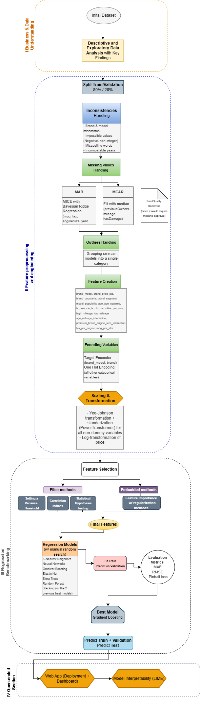

# Cars 4 You: Expediting Car Evaluations with Machine Learning
## Team (Group 37)
* Filipa Pereira, 20240509
* Gonçalo Silva, 20250354
* Marta La Feria, 20211051
* Tomás Coroa, 20250394

## 1. Project Overview
**Cars 4 You** is an online car resale company facing operational bottlenecks due to a high volume of manual mechanic inspections. This slows down the valuation process, driving potential sellers to competitors.

To address this, our project developed a robust machine learning pipeline to accurately predict a car's resale price based on seller-provided features. The primary objective was to create a reliable predictive tool that streamlines evaluation, reduces dependency on physical inspections, and provides fast, data-driven estimates.

To understand the structured path from raw data to the final predictive model, please refer to the following flowchart:

## 3. Methodology
Our approach was structured into a multi-stage pipeline designed for robustness, stability, and business alignment.

### 3.1. Data Preprocessing & Feature Engineering
* **Cleaning**:
   * **Duplicate Removal**: Initialized the process by removing duplicate records to prevent model bias and ensure data integrity.
    * **Inconsistency Correction**: Resolved spelling errors and formatting inconsistencies across all categorical variables using **fuzzy string matching**. Specifically, `Brand` and `model` entries were validated against an external car database via the **wheel-size.com API**.
   * **Logical Error Treatment**: Corrected physically impossible values, such as negative entries for `mileage`, `tax`, and `engineSize`, by applying absolute value transformations and domain-specific capping.

* **Imputation**: Applied **MICE (Multivariate Imputation by Chained Equations)** using a **Bayesian Ridge estimator** for data Missing at Random (MAR) and **median imputation** for data Missing Completely at Random (MCAR).

* **Engineering**: Created domain-specific features such as `age_squared` (to capture non-linear depreciation), `miles_per_year`, `brand_segments` (Luxury, Mid-range, Budget), ...

* **Encoding**: Adopted a dual encoding strategy based on variable cardinality. **Smoothed Target Encoding** was applied to high-cardinality features (`Brand`, `model`) to capture price relationships without expanding dimensionality, while **One-Hot Encoding** was used for low-cardinality categorical variables.

* **Transformation and Scaling**:
* **Target Transformation**: Applied a **logarithmic transformation** (`log1p`) to the `price` variable to stabilize variance and address heavy right-skewness in the target distribution.
* **Feature Normalization**: Utilized **Yeo-Johnson Power Transformations** on numerical predictors to achieve Gaussian-like distributions. This process inherently included **Standardization**, re-centering data around a zero mean with unit variance to ensure all features are on a comparable scale for the estimators.

### 3.2. Regression Benchmarking (Phase 1)
We implemented a **"Quality Funnel"** selection strategy using the **Holdout method** (80/20 split) to evaluate five algorithm families:

1. **Gradient Boosting Regressor** (Frontrunner)
2. **Extra Trees Regressor** (High-potential ensemble)
3. **Random Forest Regressor**
4. **K-Neighbors Regressor** (Discarded due to extreme overfitting)
5. **Elastic Net** (Baseline)

### 3.3. Model Optimization (Phase 2)
The top two candidates (**Gradient Boosting** and **Extra Trees**) underwent granular fine-tuning. We implemented strict **Anti-Overfitting Filters** (Ratio > 0.75) and **Dynamic Stability Checks** (ensuring MAE improvements did not degrade RMSE by > 5% or Pinball Loss by > 10% relative to the current best model).

### 3.4. Ensemble Learning & Final Selection (Phase 3)
We constructed a **Stacking Ensemble** using a Ridge meta-learner. However, following the **Principle of Parsimony (Occam’s Razor)**, the standalone **Gradient Boosting** model was selected as the final choice. While both were similar in performance, the standalone model offered better Validation MAE and Pinball Loss with lower architectural complexity.

## 4. Final Results & Insights

| Metric | Gradient Boosting (Final Model) |
| --- | --- |
| **Training MAE** | **£1078.53** |
| **Validation MAE** | **£1,270.62** |
| **Generalization Ratio** | 0.85 (Safe/Stable) |
| **Training RMSE** | £2,051.82 |
| **Validation RMSE** | £2,231.86 |
| **Training Pinball Loss** | 511.01 |
| **Validation Pinball Loss** | 602.68 |

The final model was then retrained on the **full dataset** (Training + Validation) to maximize information for the final submission.

### Interpretability (LIME)
To ensure transparency, we utilized **LIME (Local Interpretable Model-agnostic Explanations)**. This allowed us to "open the black box" and justify individual pricing decisions. For instance, we identified that for the specific vehicle analysed, **vehicle age** and **gearbox type** were the primary value drivers, while **mpg** acted as a proxy for engine performance.

## 5. Web Application
We operationalized the model through a **Streamlit Web App**, providing:

* **Real-Time Valuation**: An instant price estimation form for users.
* **Market Intelligence Dashboard**: Interactive visualizations (Radar charts, Sunburst hierarchies) for management to track market trends and inventory.
* **Live App**: [Access the Cars 4 You Interface here](https://cars4you-prediction-and-dashboard-group37.streamlit.app/)

## 6. Execution Order
1. **Part 1**: Run `car_evaluations_group37 - part1.ipynb` for EDA, data cleaning, and feature engineering (exports processed parquet files).
2. **Part 2**: Run `car_evaluations_group37 - part2.ipynb` for feature selection, model benchmarking, optimization, final prediction generation and open-ended section.